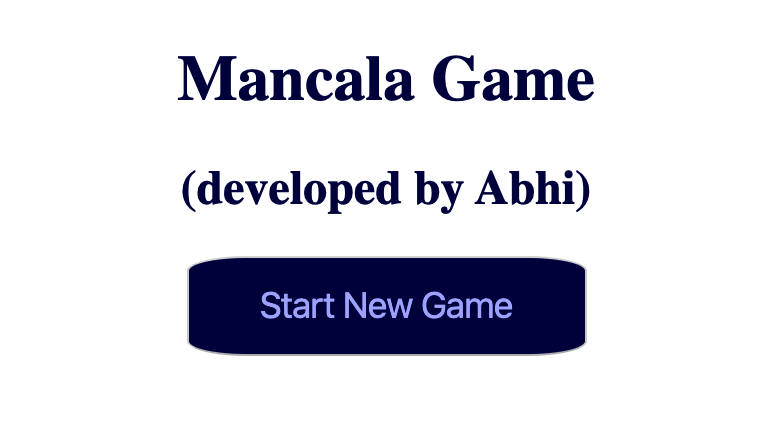
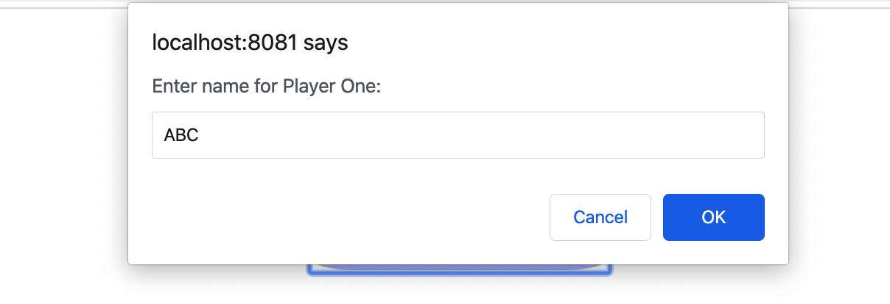
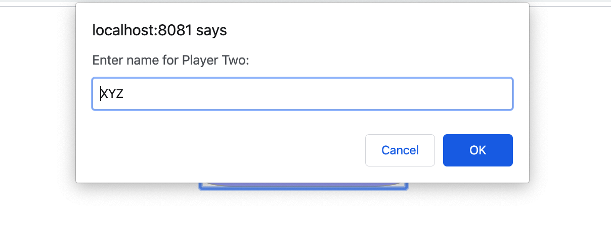
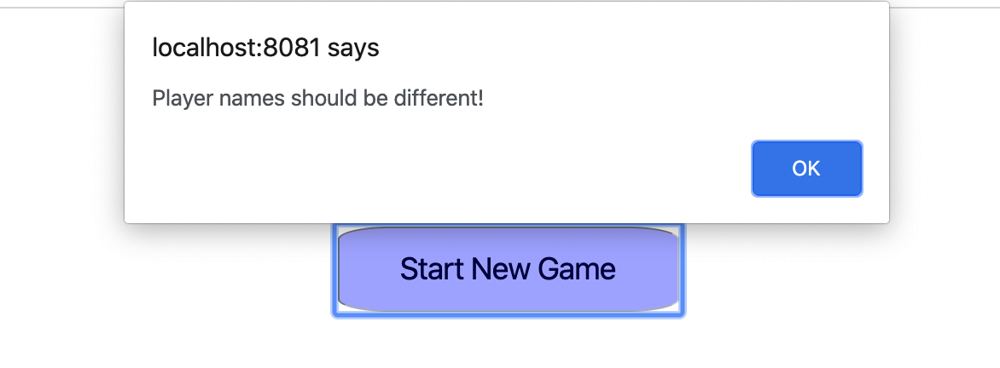
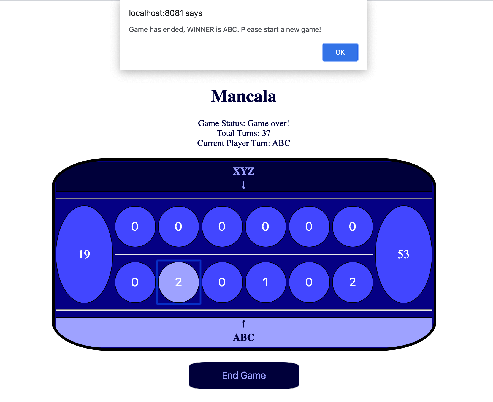

# Mancala
Mancala is a generic name for a family of two-player turn-based strategy board games played with small stones, beans, or seeds and rows of holes or pits in the earth, a board or other playing surface. The objective is usually to capture all or some set of the opponent's pieces.

## Developed using
- Java 11 (below are the specific Java 8 + features used in this project)
    - Java 10: Keyword 'var' which optionally replaces the type information when declaring local variables.
    - Java 11: Collections such as List have been extended with new methods. List.of creates a new immutable list from the given arguments.
    - Java 11: String helper method 'isBlank()' for checking strings which are empty/ have with whitespaces.
- Spring Boot framework
- Maven

## Author
- This game is a technical assignment for bol.com by Abhishek Dasgupta a.k.a. Abhi :-)

## Board Setup
Each of the two players has his six pits in front of him. To the right of the six pits, each player has a larger pit. At the start of the game, there are six stones in each
of the six round pits.

## Game Rules

- Game Play:
The player who begins with the first move picks up all the stones in any of his own six pits, and sows the stones on to the right, one in each of the following pits, including his own big pit. No stones are put in the opponents' big pit. If the
player's last stone lands in his own big pit, he gets another turn. This can be repeated several times before it's the other player's turn.

- Capturing Stones:
During the game the pits are emptied on both sides. Always when the last stone lands in an own empty pit, the player captures his own stone and all stones in the
opposite pit (the other player’s pit) and puts them in his own (big or little) pit.

- Game Ends:
The game is over as soon as one of the sides runs out of stones. The player who still has stones in his pits keeps them and puts them in his big pit. The winner of
the game is the player who has the most stones in his big pit.

## Game UI

#### Launch of the Game App

In the main screen, there is the option: "Start New Game".

#### New Game

While proceeding with a new game, you need to input the 2 players' name.

Player 1 name: 

Player 2 name: 

Names of the  2 players has to be different, otherwise it throws an error. 

#### Board Game

This will show the game board with few details like game status, total turns played, current player. Player 1 can begin his/her pick, and then the subsequent picks can go on.

The below gif file, demonstrates few special features.
- To highlight the player with the current turn the player's name will blink.
- In case of an invalid move, there will be a warning notification shown.
- There is a possibility to do 'End Game' in the middle on the game, in case the players want to start fresh again.

#### Game Ends

When one of the player wins, the game status is updated. And a notification is shown with the name of the winner.

