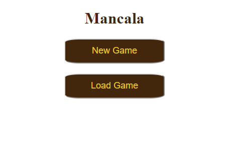
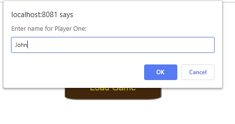
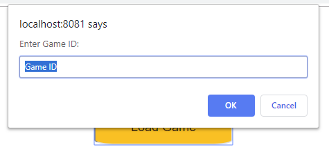
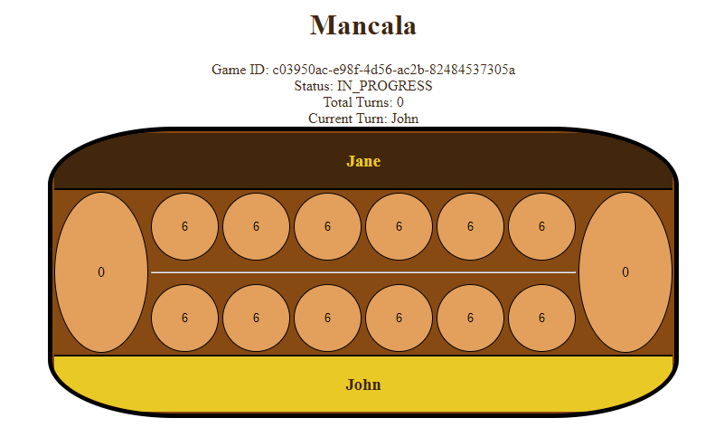
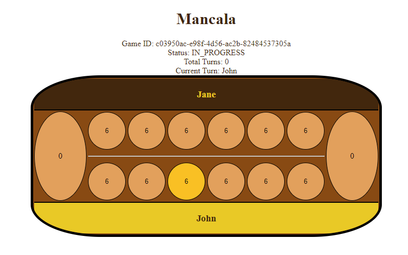
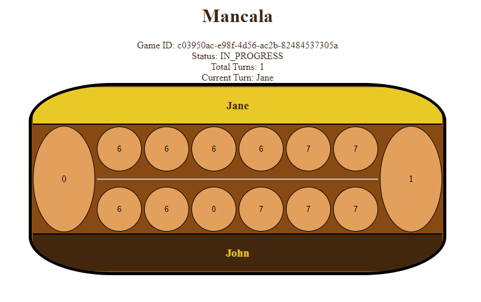

# Mancala
>Mancala is one of the oldest known games to still be widely played today. Mancala is a generic name for a family of two-player turn-based strategy board games played with small stones, beans, or seeds and rows of holes or pits in the earth, a board or other playing surface. The objective is usually to capture all or some set of the opponent's pieces. Versions of the game date back to the 7th century, and evidence suggests the game existed in ancient Egypt. - [Wikipedia](https://en.wikipedia.org/wiki/Mancala)

This game is a take-home assignment for bol.com by Ferlim Putra. I developed it using Java with Spring Boot.

## How to play
In the main screen, you will see two menus: "New Game" and "Load Game".  

### New Game
Select this to start a new game. You will be asked to input the players' name:  

### Load Game
Select this to load an existing game. You will be asked to input the ID of the game you want to load:  

### Game Board
After creating a new game or loading an existing game, you can proceed to the next page. This page will show the current game status and the game board.  

### Game Rule
>The player who begins with the first move picks up all the stones in any of his own six pits, and sows the stones on to the right, one in each of the following pits, including his own big pit. No stones are put in the opponents' big pit. If the player's last stone lands in his own big pit, he gets another turn. This can be repeated several times before it's the other player's turn.

>**Capturing Stones**  
During the game the pits are emptied on both sides. Always when the last stone lands in an own empty pit, the player captures his own stone and all stones in the opposite pit (the other player’s pit) and puts them in his own (big or little?) pit.

>**The Game Ends**  
The game is over as soon as one of the sides runs out of stones. The player who still has stones in his pits keeps them and puts them in his big pit.

### Picking up stones
When it's your turn, you can pick up stones by selecting any of your pit:  
  
After picking up the stones, the game will automatically distribute the stones to every pit to the right of your selected pit

When your turn has ended. Your opponent will get their turn to play:  

Game will end when any player's side pits are empty.

## Built With
- Java
- Spring Boot
- Maven

## Authors
- Ferlim Putra
- Thanks to bol.com for this assignment
